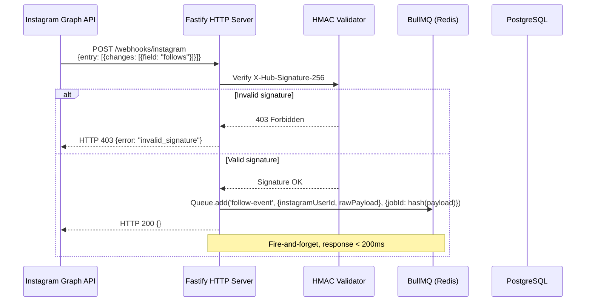
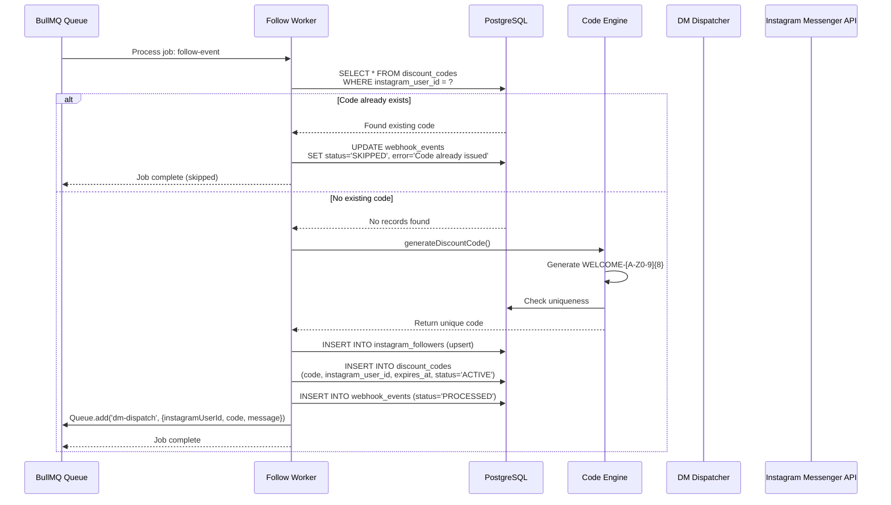
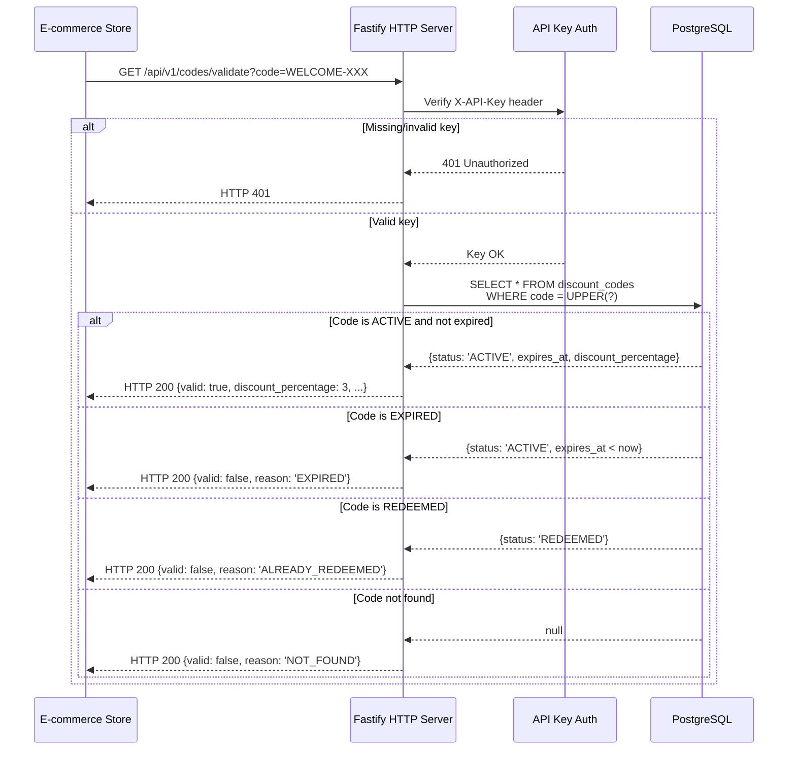
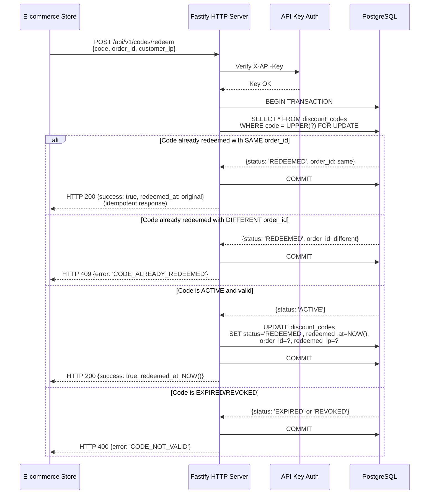
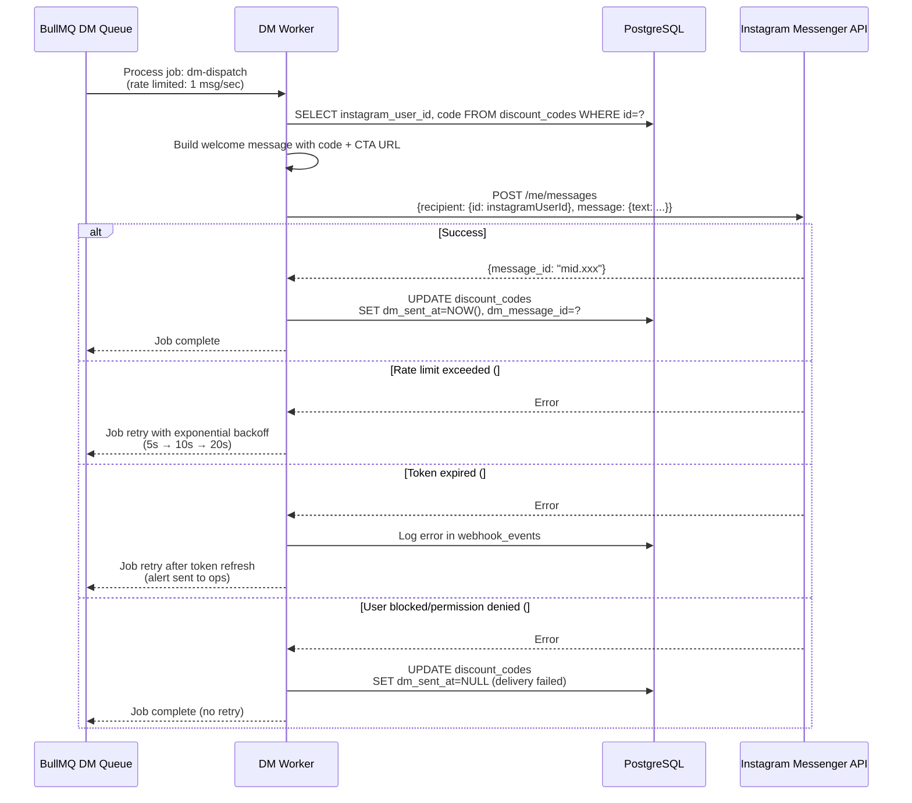

# Technical Design: Instagram Client Retention System

**Change:** instagram-client-retention  
**Version:** 1.0.0  
**Date:** 2026-05-19  
**Status:** Draft for Review

---

## Executive Summary

This document defines the technical design for a greenfield Node.js + TypeScript backend that automates client retention via Instagram DM. When a user follows the corporate Instagram account, the system generates a unique single-use 3% discount code and sends it via DM within 30 seconds. The design covers architecture decisions, project structure, component interactions, error handling, security, and deployment.

The system consists of three main surfaces: a **webhook receiver** (ingests Instagram events), an **async worker** (processes follow events, generates codes, dispatches DMs), and a **validation API** (allows the e-commerce store to validate and redeem codes).

---

## 1. Architecture Decisions

### 1.1 Runtime: Node.js 22 LTS + TypeScript

**Decision:** Node.js 22 LTS with TypeScript strict mode.

**Rationale:**
- Native async/await maps cleanly to webhook → queue → worker patterns
- TypeScript catches integration errors at compile time (critical when dealing with third-party API contracts)
- Mature ecosystem for HTTP servers, Redis clients, and ORMs
- Node.js 22 provides stable `fetch`, improved test runner, and better ESM support

**Tradeoffs considered:**
- **Python/FastAPI:** Strong alternative, but the team's existing expertise and the SPECS mandate Node.js
- **Go:** Higher throughput, but heavier development overhead for a system that won't exceed ~100 req/sec

### 1.2 Web Framework: Fastify 5.x

**Decision:** Fastify over Express.

**Rationale:**
- **Throughput:** Fastify handles 2-3x more requests/sec than Express — matters for webhook spikes
- **Schema validation:** Native JSON Schema validation via `@fastify/type-provider-json-schema` eliminates boilerplate
- **Plugin architecture:** Clean encapsulation of webhook routes, API routes, and middleware
- **Logging:** Built-in Pino integration (structured JSON logs out of the box)
- **TypeScript:** First-class type inference from schemas to route handlers

**Tradeoffs considered:**
- **Express:** Larger ecosystem, but slower and requires manual validation middleware (zod + express-validator)
- **Hono:** Excellent performance, but smaller ecosystem and less mature plugin system

### 1.3 ORM: Prisma 6

**Decision:** Prisma over Drizzle ORM and raw SQL.

**Rationale:**
- **Type generation:** Prisma Client generates fully typed queries from the schema — zero manual type definitions
- **Migrations:** `prisma migrate` handles schema evolution with rollback support
- **Relations:** The `InstagramFollower → DiscountCode` relation is expressed naturally in the schema
- **Ecosystem:** Prisma Studio for local DB inspection, mature community

**Tradeoffs considered:**
- **Drizzle ORM:** Lighter runtime, SQL-like API, but less mature relation handling and no visual DB browser
- **Raw SQL (kysely/pg):** Maximum control, but requires manual type mapping and migration scripts — overkill for 3 tables

### 1.4 Queue: BullMQ + Redis 7

**Decision:** BullMQ over raw Redis Streams and AWS SQS.

**Rationale:**
- **Built-in rate limiting:** `limiter: { max: 1, duration: 1000 }` enforces Instagram's 1 msg/sec constraint without custom logic
- **Retry strategies:** Exponential backoff configured declaratively per queue
- **Job deduplication:** `jobId` based dedup prevents duplicate DM sends
- **Observability:** BullMQ provides job counts, failed job inspection, and retry UI via Bull Board
- **Single dependency:** Redis serves both as cache (rate limiting, idempotency keys) and queue

**Tradeoffs considered:**
- **AWS SQS:** Better durability, but adds cloud vendor lock-in and lacks built-in rate limiting
- **Raw Redis Streams:** More control, but requires building retry/backoff/dedup from scratch
- **BullMQ:** Requires Redis to be always available — acceptable for this system's scale

### 1.5 HTTP Client: Axios

**Decision:** Axios over native `fetch` or `undici`.

**Rationale:**
- Automatic JSON transformation
- Built-in request/response interceptors (useful for adding Instagram token to every request)
- Mature error handling with `AxiosError` type hierarchy
- Timeout configuration per request

**Tradeoffs considered:**
- **Native fetch:** No dependency, but requires manual JSON parsing and error type narrowing
- **Undici:** Faster, but API is lower-level and less ergonomic for this use case

### 1.6 Validation: Zod 3

**Decision:** Zod for runtime validation of all external inputs.

**Rationale:**
- Single source of truth: Zod schemas generate TypeScript types
- Fastify integration via `@fastify/type-provider-zod`
- Rich error messages for API consumers
- Used for webhook payloads, query params, request bodies, and code format validation

---

## 2. Project Structure

```
instagram-message-sender/
├── prisma/
│   ├── schema.prisma           # Data models (InstagramFollower, DiscountCode, WebhookEvent)
│   └── migrations/             # Prisma migration files
│
├── src/
│   ├── app.ts                  # Fastify app factory (plugins, routes, middleware registration)
│   ├── server.ts               # Entry point — starts HTTP server and workers
│   ├── worker.ts               # Entry point — starts BullMQ worker process
│   │
│   ├── config/
│   │   ├── env.ts              # Environment variable parsing with Zod
│   │   └── constants.ts        # Magic numbers, timeouts, rate limits
│   │
│   ├── plugins/
│   │   ├── prisma.ts           # Fastify plugin: decorates app with prisma client
│   │   ├── redis.ts            # Fastify plugin: decorates app with ioredis connection
│   │   ├── bullmq.ts           # Fastify plugin: decorates app with BullMQ queues
│   │   └── swagger.ts          # Fastify plugin: OpenAPI documentation (dev only)
│   │
│   ├── middleware/
│   │   ├── hmac-validator.ts   # HMAC-SHA256 signature verification
│   │   ├── api-key-auth.ts     # API key authentication for validation endpoints
│   │   └── error-handler.ts    # Global error handler with structured logging
│   │
│   ├── routes/
│   │   ├── webhooks/
│   │   │   ├── instagram.ts    # POST /webhooks/instagram + GET handshake
│   │   │   └── instagram.schema.ts  # Zod schemas for webhook payloads
│   │   │
│   │   └── api/
│   │       ├── codes.ts        # GET /api/v1/codes/validate, POST /api/v1/codes/redeem
│   │       └── codes.schema.ts # Zod schemas for validation/redeem requests/responses
│   │
│   ├── services/
│   │   ├── code-engine.ts      # Discount code generation with collision retry
│   │   ├── dm-dispatcher.ts    # Instagram Messenger API client
│   │   ├── webhook-processor.ts # Business logic for processing follow events
│   │   └── token-manager.ts    # Instagram token validation and expiry tracking
│   │
│   ├── queues/
│   │   ├── follow-queue.ts     # Queue definition for follow events
│   │   ├── dm-queue.ts         # Queue definition for DM dispatch (rate-limited)
│   │   └── job-handlers.ts     # Job processor functions (consumed by worker.ts)
│   │
│   ├── utils/
│   │   ├── logger.ts           # Pino logger configuration
│   │   ├── crypto.ts           # HMAC verification, API key hashing
│   │   └── retry.ts            # Generic retry wrapper with exponential backoff
│   │
│   └── health/
│       └── health.ts           # GET /health endpoint
│
├── test/
│   ├── unit/
│   │   ├── code-engine.test.ts
│   │   ├── hmac-validator.test.ts
│   │   └── api-key-auth.test.ts
│   ├── integration/
│   │   ├── webhook-route.test.ts
│   │   ├── codes-route.test.ts
│   │   └── health-route.test.ts
│   └── fixtures/
│       ├── webhook-payloads.ts
│       └── test-db.ts
│
├── docker-compose.yml          # Local dev: PostgreSQL + Redis
├── Dockerfile                  # Production container
├── .env.example                # Template for environment variables
├── package.json
├── tsconfig.json
└── vitest.config.ts
```

### 2.1 Process Architecture

The system runs as **two separate processes** sharing the same codebase:

| Process | Entry Point | Responsibility |
|---------|-------------|----------------|
| **HTTP Server** | `src/server.ts` | Receives webhooks, serves validation API, health checks |
| **Worker** | `src/worker.ts` | Consumes BullMQ jobs, generates codes, dispatches DMs |

**Why separate processes:**
- The worker needs different resource profile (CPU for code generation, network for IG API calls)
- Independent scaling: can run multiple worker instances if volume increases
- Failure isolation: worker crash doesn't affect API availability
- Different lifecycle: worker can be paused during token rotation without affecting validation API

**Shared resources:** PostgreSQL and Redis connections are configured via the same environment variables but instantiated separately per process.

---

## 3. Sequence Diagrams

### 3.1 Webhook Processing Flow



### 3.2 Follow Event Processing (Worker)



### 3.3 Code Validation Flow



### 3.4 Code Redemption Flow (Idempotent)



### 3.5 DM Dispatch Flow (Rate-Limited)



---

## 4. Component Interaction Patterns

### 4.1 Dependency Injection via Fastify Decorate

All services are registered as Fastify decorators, making them accessible via `request.server` or `app` in route handlers:

```typescript
// Registration (in plugins/)
app.decorate('prisma', prismaClient);
app.decorate('redis', redisClient);
app.decorate('followQueue', followQueue);
app.decorate('dmQueue', dmQueue);
app.decorate('codeEngine', new CodeEngine(prismaClient));
app.decorate('dmDispatcher', new DMDispatcher(axiosInstance, config));

// Usage in routes
app.post('/webhooks/instagram', async (request, reply) => {
  await request.server.followQueue.add('follow-event', payload);
  return reply.send({});
});
```

### 4.2 Service Layer Isolation

Services contain business logic only — no HTTP concerns:

| Service | Input | Output | Dependencies |
|---------|-------|--------|--------------|
| `CodeEngine` | None | `string` (code) | PrismaClient |
| `DMDispatcher` | `{instagramUserId, message}` | `{messageId: string}` | Axios, config |
| `WebhookProcessor` | `{instagramUserId, rawPayload}` | `void` | PrismaClient, CodeEngine, Queue |
| `TokenManager` | None | `{valid: boolean, expiresInDays: number}` | Axios, config |

### 4.3 Queue Job Schema

All jobs use typed payloads with Zod validation at consumption time:

```typescript
// queues/follow-queue.ts
export const FollowEventJobSchema = z.object({
  instagramUserId: z.string().min(1).max(64),
  rawPayload: z.record(z.unknown()),
  webhookEventId: z.string().uuid(),
});

export type FollowEventJob = z.infer<typeof FollowEventJobSchema>;
```

### 4.4 Event Flow Summary

```
Instagram → [Webhook Receiver] → [Redis Queue] → [Worker]
                                              ↙         ↘
                                        [Code Engine]  [DM Dispatcher]
                                             ↓              ↓
                                        [PostgreSQL]   [Instagram API]

E-commerce Store → [Validation API] → [PostgreSQL]
```

---

## 5. Error Handling Strategy

### 5.1 Error Classification

| Category | HTTP Status | Logging | Retry | Alert |
|----------|-------------|---------|-------|-------|
| **Client error** (bad signature, missing key, invalid format) | 4xx | Warn | No | No |
| **Business error** (code already redeemed, user already has code) | 200/409 | Info | No | No |
| **Transient error** (IG rate limit, DB connection timeout) | 503 | Error | Yes (exponential backoff) | After N retries |
| **Fatal error** (token expired, DB unavailable, misconfigured queue) | 500 | Fatal | No | Immediate |

### 5.2 Webhook Error Handling

The webhook receiver follows a **fail-fast, log-everything** strategy:

1. **Signature invalid:** Return `403` immediately. Log the raw body hash (not the body itself) for audit.
2. **Queue unavailable:** Return `200` anyway (Instagram will retry). Log critical error. A cron job will reprocess PENDING webhook_events.
3. **Malformed payload:** Return `200` (ACK), log error, mark webhook_event as FAILED. Do not crash the request handler.

### 5.3 Worker Error Handling

The worker uses BullMQ's built-in retry with exponential backoff:

```typescript
const dmWorker = new Worker('instagram-dm', async (job) => {
  try {
    await processDmJob(job.data);
  } catch (error) {
    if (isRetryableError(error)) {
      throw error; // BullMQ will retry based on job options
    }
    // Non-retryable: log and mark as failed without retry
    job.moveToFailed(error, true);
  }
}, {
  connection: redis,
  limiter: { max: 1, duration: 1000 },
  concurrency: 1,
});
```

**Retryable errors:** Rate limits (#4, #613), network timeouts, DB connection errors.  
**Non-retryable errors:** Permission denied (#10), invalid token (#190), invalid parameter (#100), user blocked.

### 5.4 Dead Letter Queue

Failed jobs after max retries are moved to a dead letter pattern via BullMQ's `events` listener:

```typescript
dmWorker.on('failed', (job, err) => {
  logger.error({ jobId: job.id, error: err.message, data: job.data }, 'DM job permanently failed');
  // Store in DB for manual inspection
  db.webhookEvent.create({
    data: { eventType: 'dm_failed', rawPayload: job.data, processingStatus: 'FAILED', errorMessage: err.message }
  });
});
```

### 5.5 Global Error Handler

Fastify's `setErrorHandler` catches all unhandled errors:

```typescript
app.setErrorHandler((error, request, reply) => {
  logger.error({ err: error, path: request.url }, 'Unhandled error');
  
  if (error instanceof ValidationError) {
    return reply.code(400).send({ error: 'validation_error', details: error.details });
  }
  if (error instanceof UnauthorizedError) {
    return reply.code(401).send({ error: 'unauthorized' });
  }
  
  // Default: 500 with generic message (never leak internals)
  return reply.code(500).send({ error: 'internal_server_error' });
});
```

---

## 6. Security Architecture

### 6.1 Threat Model

| Threat Vector | Attack Surface | Mitigation |
|---------------|----------------|------------|
| **Webhook spoofing** | `POST /webhooks/instagram` | HMAC-SHA256 verification with `crypto.timingSafeEqual` |
| **API key theft** | `GET/POST /api/v1/codes/*` | Hashed keys in DB (SHA-256), HTTPS only, quarterly rotation |
| **Code enumeration** | `GET /api/v1/codes/validate` | Rate limiting (10 req/min/IP), 1.1B combination space |
| **Replay attacks** | Webhook endpoint | Job deduplication via `jobId` (hash of raw payload) |
| **IDOR** | Validation API | Codes are opaque tokens; no user ID exposed in API |
| **Secret exposure** | Logs, error messages | Redact env vars in logs, generic error responses |
| **Token hijacking** | Instagram API calls | Token stored in env only, never logged, TLS for all outbound calls |

### 6.2 HMAC Verification Implementation

```typescript
// middleware/hmac-validator.ts
import { timingSafeEqual, createHmac } from 'crypto';

export function verifyInstagramSignature(
  rawBody: Buffer,
  signature: string,
  appSecret: string
): boolean {
  const expected = `sha256=${createHmac('sha256', appSecret).update(rawBody).digest('hex')}`;
  
  // Prevent timing attacks
  if (signature.length !== expected.length) return false;
  return timingSafeEqual(Buffer.from(signature), Buffer.from(expected));
}
```

**Critical:** The raw body buffer must be captured before any JSON parsing. Fastify's `preParsing` hook is used for this.

### 6.3 API Key Authentication

API keys are stored as SHA-256 hashes, never in plaintext:

```
Plaintext key: sk_live_abc123...
Stored hash:   SHA256(sk_live_abc123...) = 8f4e...
```

On each request:
1. Hash the incoming `X-API-Key` header
2. Look up the hash in the `api_keys` table
3. Check `isActive = true` and `expiresAt > NOW()`

### 6.4 Rate Limiting Layers

| Layer | Target | Limit | Tool |
|-------|--------|-------|------|
| Webhook | Per IP | 100 req/min | `@fastify/rate-limit` |
| Validation API | Per API key | 100 req/min | `@fastify/rate-limit` |
| Validation API | Per IP | 10 req/min | `@fastify/rate-limit` |
| DM Dispatch | Global | 1 msg/sec | BullMQ `limiter` |

### 6.5 Security Headers

```typescript
await app.register(helmet, {
  contentSecurityPolicy: { directives: { defaultSrc: ["'none'"] } },
  hsts: { maxAge: 31536000, includeSubDomains: true },
  frameguard: { action: 'deny' },
  noSniff: true,
  xssFilter: true,
  referrerPolicy: { policy: 'no-referrer' },
});
```

### 6.6 Secrets Management

| Secret | Storage | Rotation |
|--------|---------|----------|
| `INSTAGRAM_APP_SECRET` | Doppler / AWS Secrets Manager | Manual (per Meta dashboard) |
| `INSTAGRAM_PAGE_ACCESS_TOKEN` | Doppler / AWS Secrets Manager | Every 60 days (automated job planned) |
| `DATABASE_URL` | Doppler / AWS Secrets Manager | Per DB provider policy |
| `REDIS_URL` | Doppler / AWS Secrets Manager | Per Redis provider policy |
| `API_KEY_HASH_SECRET` | Doppler / AWS Secrets Manager | Quarterly (requires store reconfiguration) |

---

## 7. Deployment Considerations

### 7.1 Infrastructure Requirements

| Component | Minimum (Dev) | Production |
|-----------|---------------|------------|
| **CPU** | 1 core | 2 cores |
| **Memory** | 512 MB | 1 GB |
| **PostgreSQL** | 1 GB storage | 10 GB + automated backups |
| **Redis** | 256 MB | 512 MB + persistence (AOF) |
| **Network** | Outbound HTTPS | Outbound HTTPS + inbound HTTPS (webhook) |

### 7.2 Docker Configuration

```dockerfile
# Multi-stage build
FROM node:22-alpine AS builder
WORKDIR /app
COPY package.json pnpm-lock.yaml ./
RUN corepack enable && pnpm install --frozen-lockfile
COPY . .
RUN pnpm build

FROM node:22-alpine AS runner
WORKDIR /app
COPY --from=builder /app/dist ./dist
COPY --from=builder /app/node_modules ./node_modules
COPY --from=builder /app/prisma ./prisma

RUN npx prisma generate

# HTTP server process
CMD ["node", "dist/server.js"]
```

**Worker process** uses the same image with a different CMD:
```dockerfile
CMD ["node", "dist/worker.js"]
```

### 7.3 Local Development

```yaml
# docker-compose.yml
services:
  postgres:
    image: postgres:16-alpine
    environment:
      POSTGRES_DB: instagram_retention
      POSTGRES_USER: dev
      POSTGRES_PASSWORD: dev
    ports: ["5432:5432"]
    volumes: ["pgdata:/var/lib/postgresql/data"]

  redis:
    image: redis:7-alpine
    ports: ["6379:6379"]
    volumes: ["redisdata:/data"]

volumes:
  pgdata:
  redisdata:
```

### 7.4 Environment Strategy

| Env | Purpose | Data | Instagram App |
|-----|---------|------|---------------|
| `development` | Local dev | Seeded test data | Sandbox app (test users only) |
| `staging` | Pre-production | Mirrored prod schema | Staging app (approved testers) |
| `production` | Live traffic | Real user data | Production app (Advanced Access) |

### 7.5 Health Checks

The `/health` endpoint checks:
1. **Database connectivity:** `SELECT 1`
2. **Redis connectivity:** `PING`
3. **Instagram token validity:** Decode JWT or check expiry timestamp
4. **Queue health:** BullMQ `getJobCounts()` — alert if failed jobs > threshold

Kubernetes/liveness probe: `GET /health` → 200 = healthy, 503 = restart container.

### 7.6 Monitoring & Alerting

| Metric | Tool | Alert Threshold |
|--------|------|-----------------|
| Failed DM jobs | BullMQ events → Sentry | > 5 failures in 10 min |
| Webhook latency | Fastify `onResponse` hook → Prometheus | p99 > 200ms |
| Validation API latency | Fastify `onResponse` hook → Prometheus | p99 > 100ms |
| Instagram token expiry | TokenManager check | < 7 days remaining |
| DB connection pool | Prisma engine metrics | > 80% utilized |
| Redis memory | Redis INFO | > 80% of maxmemory |

---

## 8. Testing Strategy

### 8.1 Test Pyramid

```
        ┌─────────┐
        │  E2E    │  ← Manual testing with real Instagram sandbox
        ├─────────┤
        │Integration│ ← Supertest against test DB + mocked Redis/IG API
        ├─────────┤
        │  Unit   │  ← Vitest: services, utils, middleware
        └─────────┘
```

### 8.2 Unit Tests (Vitest)

| Module | What to Test |
|--------|-------------|
| `code-engine.ts` | Code format matches regex, collision retry, max retries throws |
| `hmac-validator.ts` | Valid signature returns true, invalid returns false, timing-safe |
| `api-key-auth.ts` | Valid key passes, expired key rejected, missing key throws |
| `buildWelcomeMessage()` | Message contains code, CTA URL is correct, no HTML |

### 8.3 Integration Tests (Supertest)

| Route | Test Cases |
|-------|-----------|
| `POST /webhooks/instagram` | Valid signature → 200 + job queued; Invalid → 403; GET handshake → 200 + challenge |
| `GET /api/v1/codes/validate` | Active code → valid:true; Expired → valid:false; No key → 401 |
| `POST /api/v1/codes/redeem` | First redeem → 200; Same order_id → 200 (idempotent); Different order_id → 409 |
| `GET /health` | All services up → 200; DB down → 503 |

### 8.4 Test Database Strategy

- Each integration test runs in a transaction that is rolled back after the test
- Use `testcontainers` for spinning up real PostgreSQL and Redis during CI
- Mock Instagram API responses with `msw` (Mock Service Worker)

---

## 9. Risks and Mitigations

| Risk | Impact | Likelihood | Mitigation |
|------|--------|------------|------------|
| **Instagram API changes** | High | Medium | Abstract IG API calls behind `DMDispatcher` interface; comprehensive error logging for new error codes |
| **Webhook field `follows` not available** | High | Low | Verify Advanced Access approval before deployment; fallback to polling IG followers endpoint (not implemented initially) |
| **Redis outage** | High | Low | Queue jobs are persisted in `webhook_events` table; cron job reprocesses PENDING events when Redis recovers |
| **Token expiration during peak** | Medium | Medium | TokenManager checks expiry before each DM send; alert at 7 days; manual rotation documented |
| **Code brute force** | Medium | Low | Rate limiting + 1.1B space; monitor for IPs hitting rate limit repeatedly |
| **Store integration delays** | Low | Medium | Validation API is independent; store can integrate at any time; API contract is stable |
| **Database migration failures** | Medium | Low | Prisma migrations are tested in staging first; rollback plan documented |

---

## 10. Future Considerations (Out of Scope for v1)

| Feature | Description | Complexity |
|---------|-------------|------------|
| **Token rotation automation** | Auto-refresh Instagram token via OAuth flow every 60 days | Medium |
| **Click tracking** | URL shortener with analytics for CTA links | Low |
| **Follow-up sequences** | Second DM after 7 days if code not redeemed | Medium |
| **Admin dashboard** | Visual UI for monitoring codes, followers, redemption rates | High |
| **Multi-account support** | Support multiple Instagram business accounts | Medium |
| **CRM integration** | Push follower data to Salesforce/HubSpot | Medium |
